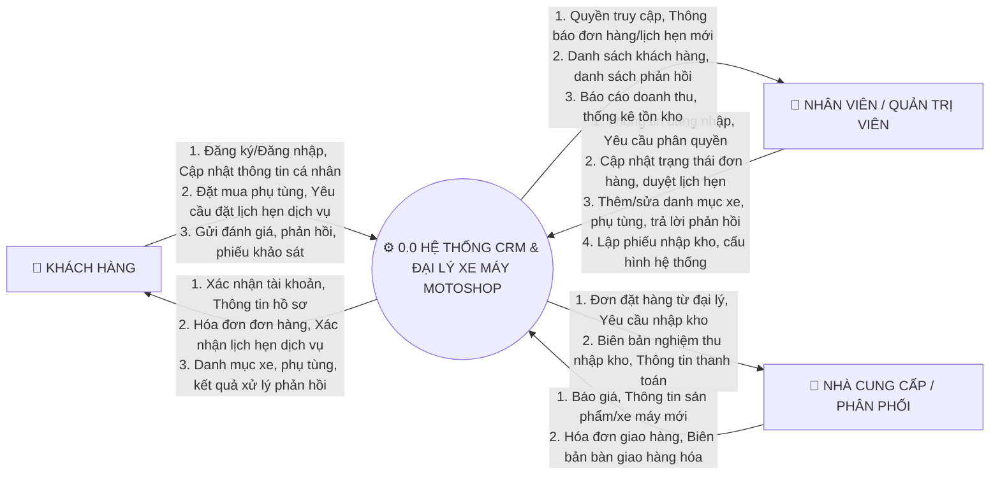
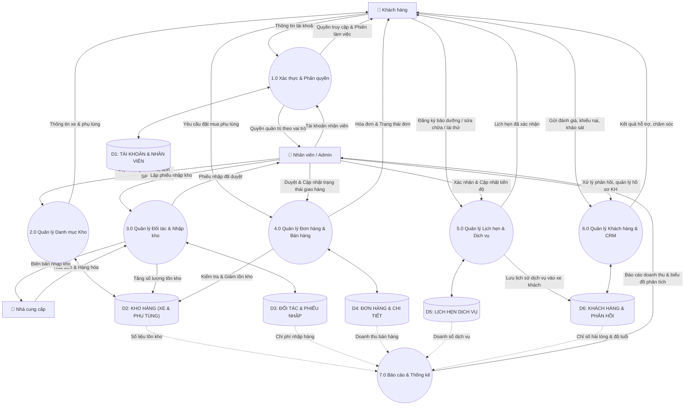
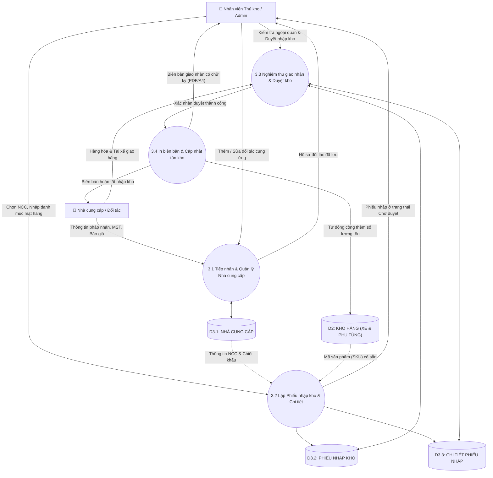
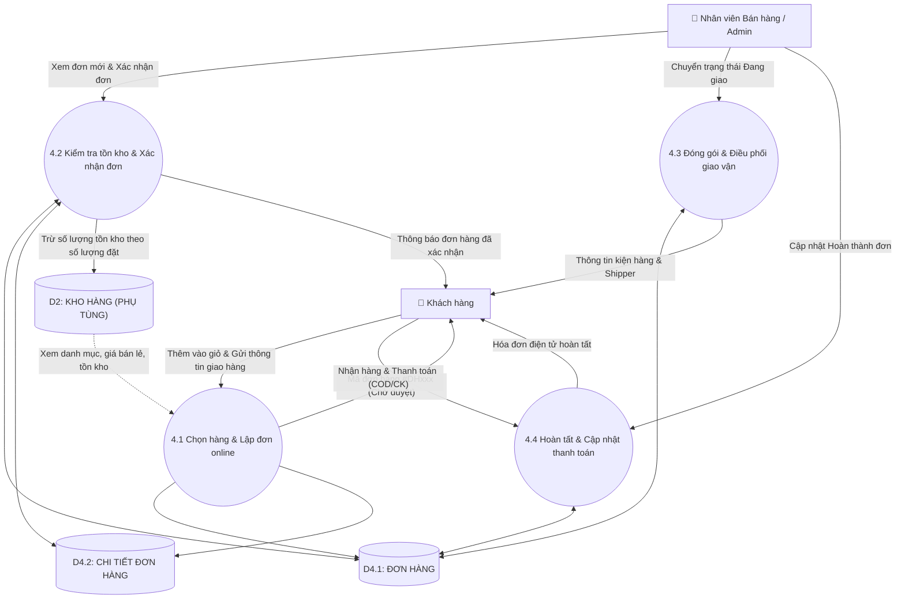
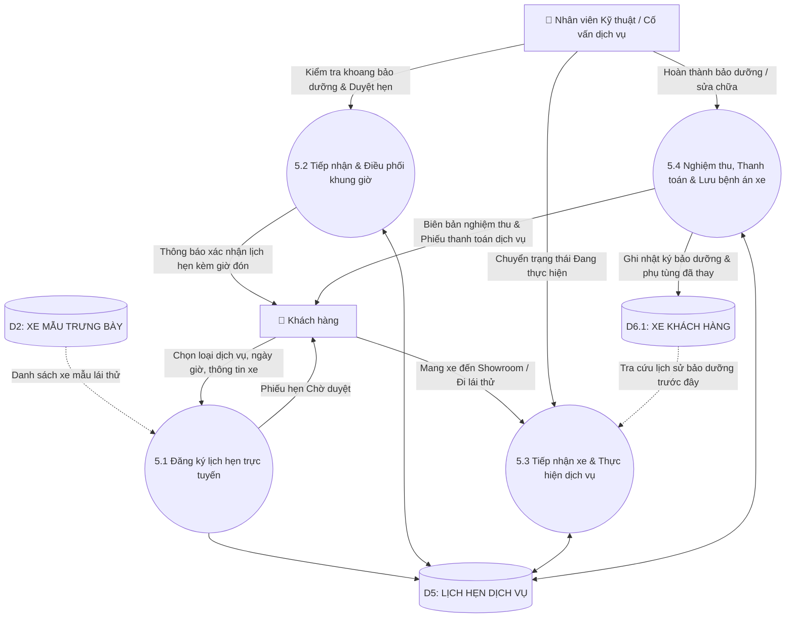

# 📊 HỆ THỐNG SƠ ĐỒ BFD VÀ DFD (MỨC 0, 1, 2)
### DỰ ÁN: HỆ THỐNG CRM & E-COMMERCE ĐẠI LÝ XE MÁY VÀ PHỤ TÙNG (MOTOSHOP)

---

## I. SƠ ĐỒ PHÂN RÃ CHỨC NĂNG BFD (BUSINESS FUNCTION DIAGRAM)

Sơ đồ BFD phân rã cấu trúc toàn bộ các chức năng nghiệp vụ của hệ thống từ mức cao nhất (Hệ thống tổng thể) xuống các phân hệ và chức năng chi tiết.

```mermaid
flowchart TD
    ROOT["HỆ THỐNG CRM & ĐẠI LÝ XE MÁY PHỤ TÙNG MOTOSHOP"]

    %% Cấp 1
    F1["1.0 Quản trị Hệ thống & Phân quyền"]
    F2["2.0 Quản lý Kho & Danh mục Hàng hóa"]
    F3["3.0 Đối tác & Chuỗi cung ứng"]
    F4["4.0 Bán hàng & Quản lý Đơn hàng"]
    F5["5.0 Quản lý Lịch hẹn & Dịch vụ"]
    F6["6.0 Khách hàng & Chăm sóc CRM"]
    F7["7.0 Báo cáo & Thống kê"]

    ROOT --> F1
    ROOT --> F2
    ROOT --> F3
    ROOT --> F4
    ROOT --> F5
    ROOT --> F6
    ROOT --> F7

    %% Phân rã 1.0
    F1_1["1.1 Đăng nhập & Xác thực tài khoản"]
    F1_2["1.2 Quản lý tài khoản nhân sự"]
    F1_3["1.3 Phân quyền vai trò: Admin / Sale / Kỹ thuật"]
    F1_4["1.4 Đổi mật khẩu & Khóa tài khoản"]
    F1 --> F1_1
    F1 --> F1_2
    F1 --> F1_3
    F1 --> F1_4

    %% Phân rã 2.0
    F2_1["2.1 Quản lý danh mục phụ tùng"]
    F2_2["2.2 Quản lý danh mục xe mẫu"]
    F2_3["2.3 Tra cứu, tìm kiếm & lọc hàng hóa"]
    F2_4["2.4 Theo dõi cảnh báo tồn kho"]
    F2 --> F2_1
    F2 --> F2_2
    F2 --> F2_3
    F2 --> F2_4

    %% Phân rã 3.0
    F3_1["3.1 Quản lý thông tin Nhà cung cấp"]
    F3_2["3.2 Lập phiếu nhập kho mới"]
    F3_3["3.3 Quản lý chi tiết mặt hàng nhập"]
    F3_4["3.4 Kiểm duyệt & Tăng tồn kho tự động"]
    F3_5["3.5 In biên bản giao nhận hàng hóa"]
    F3 --> F3_1
    F3 --> F3_2
    F3 --> F3_3
    F3 --> F3_4
    F3 --> F3_5

    %% Phân rã 4.0
    F4_1["4.1 Giỏ hàng & Đặt hàng online"]
    F4_2["4.2 Tiếp nhận & Xét duyệt đơn hàng"]
    F4_3["4.3 Điều phối giao hàng & Thanh toán"]
    F4_4["4.4 Hủy đơn & Trừ tồn kho tự động"]
    F4 --> F4_1
    F4 --> F4_2
    F4 --> F4_3
    F4 --> F4_4

    %% Phân rã 5.0
    F5_1["5.1 Đặt lịch hẹn: Bảo dưỡng / Sửa chữa / Lái thử"]
    F5_2["5.2 Tiếp nhận & Xác nhận lịch hẹn"]
    F5_3["5.3 Theo dõi tiến độ thực hiện dịch vụ"]
    F5_4["5.4 Lưu lịch sử bảo dưỡng xe khách hàng"]
    F5 --> F5_1
    F5 --> F5_2
    F5 --> F5_3
    F5 --> F5_4

    %% Phân rã 6.0
    F6_1["6.1 Quản lý hồ sơ khách hàng"]
    F6_2["6.2 Quản lý thông tin xe của khách"]
    F6_3["6.3 Tiếp nhận phản hồi & Khiếu nại"]
    F6_4["6.4 Khảo sát độ hài lòng khách hàng"]
    F6_5["6.5 Đánh giá & Bình luận sản phẩm"]
    F6 --> F6_1
    F6 --> F6_2
    F6 --> F6_3
    F6 --> F6_4
    F6 --> F6_5

    %% Phân rã 7.0
    F7_1["7.1 Thống kê doanh thu theo ngày / tuần / tháng / năm"]
    F7_2["7.2 Thống kê doanh số bán xe vs phụ tùng"]
    F7_3["7.3 Thống kê chi phí nhập hàng từ NCC"]
    F7_4["7.4 Phân tích cơ cấu khách hàng & dịch vụ"]
    F7 --> F7_1
    F7 --> F7_2
    F7 --> F7_3
    F7 --> F7_4
```

---

## II. SƠ ĐỒ DFD MỨC 0 (MỨC NGỮ CẢNH — CONTEXT DIAGRAM)

Sơ đồ thể hiện luồng trao đổi thông tin tổng quát giữa Hệ thống MOTOSHOP với 3 Tác nhân bên ngoài (External Entities):
1. **Khách hàng (Customer)**
2. **Nhân viên / Quản trị viên (Staff / Admin)**
3. **Nhà cung cấp / Phân phối (Supplier)**

---

## III. SƠ ĐỒ DFD MỨC 1 (MỨC ĐỈNH — TOP-LEVEL DIAGRAM)

Phân rã hệ thống thành **7 Tiến trình xử lý cốt lõi** và **6 Kho lưu trữ dữ liệu (Data Stores)**:
- `D1: TAI_KHOAN & NHAN_VIEN`
- `D2: KHO_HANG (PHU_TUNG & SAN_PHAM_XE)`
- `D3: NHA_CUNG_CAP & PHIEU_NHAP`
- `D4: DON_HANG & CHI_TIET_DON_HANG`
- `D5: LICH_HEN_DICH_VU`
- `D6: KHACH_HANG, XE_KH, PHAN_HOI & KHAO_SAT`

---

## IV. SƠ ĐỒ DFD MỨC 2 (MỨC DƯỚI ĐỈNH — CHI TIẾT TỪNG NGHIỆP VỤ)

Ở mức 2, chúng ta phân rã sâu vào **3 phân hệ nghiệp vụ quan trọng nhất** của đề tài:
1. **Phân rã 3.0: Quản lý Đối tác & Nhập kho (Chuỗi cung ứng)**
2. **Phân rã 4.0: Quản lý Đơn hàng & Bán hàng**
3. **Phân rã 5.0: Quản lý Lịch hẹn Dịch vụ & Lái thử**

---

### 1. DFD Mức 2 — Phân rã Tiến trình 3.0: Quản lý Đối tác & Nhập kho

---

### 2. DFD Mức 2 — Phân rã Tiến trình 4.0: Quản lý Bán hàng & Đơn hàng phụ tùng

---

### 3. DFD Mức 2 — Phân rã Tiến trình 5.0: Quản lý Lịch hẹn Dịch vụ Kỹ thuật & Lái thử

---

## V. BẢNG ĐỐI CHIẾU THỰC THỂ, TIẾN TRÌNH VÀ KHO DỮ LIỆU

| Ký hiệu | Tên đối tượng | Ý nghĩa trong hệ thống CRM MOTOSHOP |
|:---:|:---|:---|
| **Tác nhân** | `👤 Khách hàng` | Người dùng mua phụ tùng, xem xe, đặt lịch dịch vụ, gửi phản hồi |
| **Tác nhân** | `👔 Nhân viên / Admin` | Ban quản trị, nhân viên bán hàng, kỹ thuật viên xưởng dịch vụ |
| **Tác nhân** | `🏢 Nhà cung cấp` | Các hãng xe (Honda, Yamaha) & thương hiệu phụ tùng (Motul, Michelin, Brembo...) |
| **Tiến trình 1.0** | Xác thực & Phân quyền | Quản lý đăng nhập, cấp quyền theo vai trò (`SuperAdmin`, `Sale`, `Kỹ thuật`) |
| **Tiến trình 2.0** | Quản lý Danh mục Kho | Quản lý 18+ mã phụ tùng và 14+ mẫu xe máy trưng bày |
| **Tiến trình 3.0** | Đối tác & Nhập kho | Quản lý nhà phân phối, tạo phiếu nhập kho, biên bản giao nhận và tăng tồn |
| **Tiến trình 4.0** | Đơn hàng & Bán hàng | Giỏ hàng, duyệt đơn, xuất kho, điều phối giao hàng |
| **Tiến trình 5.0** | Lịch hẹn & Dịch vụ | Đặt hẹn bảo dưỡng/sửa chữa/lái thử, điều phối kỹ thuật, lưu bệnh án xe |
| **Tiến trình 6.0** | Khách hàng & CRM | Quản lý hồ sơ KH, xe sở hữu, giải quyết khiếu nại, khảo sát ý kiến |
| **Tiến trình 7.0** | Báo cáo & Thống kê | Tổng hợp doanh thu, lợi nhuận gộp, cơ cấu khách hàng và dịch vụ |
| **Kho D1** | `TAI_KHOAN` | Lưu trữ username, password băm, quyền hạn, nhân viên |
| **Kho D2** | `KHO_HANG` | Lưu trữ `PHU_TUNG` (tồn kho, giá) và `SAN_PHAM_XE` |
| **Kho D3** | `DOI_TAC_NHAP_KHO` | Lưu trữ `NHA_CUNG_CAP`, `PHIEU_NHAP` và `CHI_TIET_PHIEU_NHAP` |
| **Kho D4** | `DON_HANG` | Lưu trữ `DON_HANG` và `CHI_TIET_DON_HANG` |
| **Kho D5** | `LICH_HEN` | Lưu trữ thông tin hẹn dịch vụ, ngày giờ, loại dịch vụ, trạng thái |
| **Kho D6** | `KHACH_HANG_CRM` | Lưu trữ `KHACH_HANG`, `XE_KHACH_HANG`, `PHAN_HOI`, `KHAO_SAT` |
